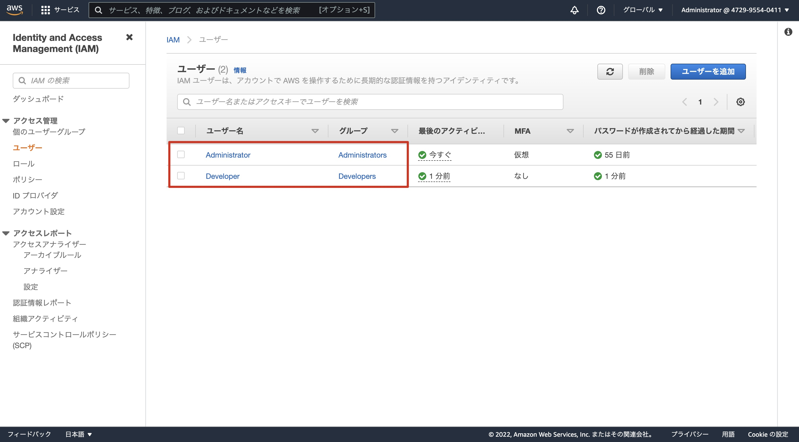
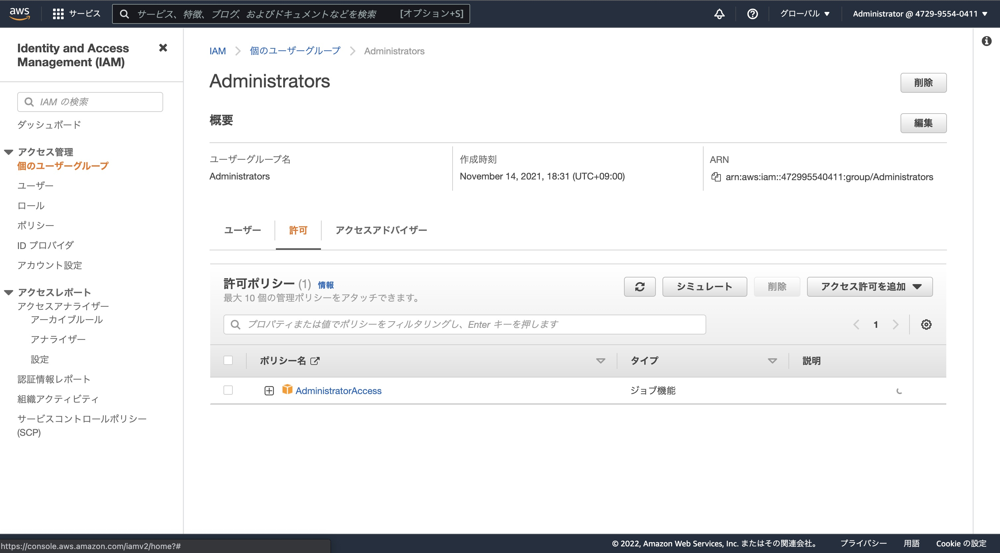
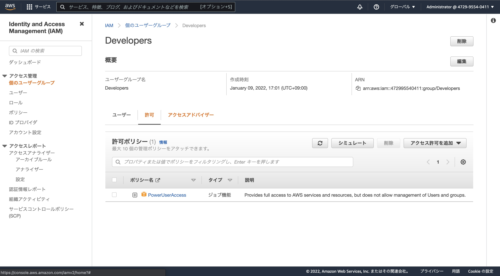

# 05.
## 課題内容
[ここ](../README.md#05.)

## 手順
1. Administratorsグループの作成とAdministratorユーザの編集
    ```sh
    # IAMグループ作成
    $ aws iam create-group --group-name Administrators   
    {
        "Group": {
            "Path": "/",
            "GroupName": "Administrators",
            "GroupId": "AGPAW4IF3FW5UFHOBGBVO",
            "Arn": "arn:aws:iam::472995540411:group/Administrators",
            "CreateDate": "2022-01-09T07:14:45+00:00"
        }
    }

    # IAMグループへAdministratorAccessポリシーのアタッチ
    $ aws iam attach-group-policy --group-name Administrators --policy-arn arn:aws:iam::aws:policy/AdministratorAccess

    # ポリシーがアタッチされているか確認
    $ aws iam list-attached-group-policies --group-name Administrators
    {
        "AttachedPolicies": [
            {
                "PolicyName": "AdministratorAccess",
                "PolicyArn": "arn:aws:iam::aws:policy/AdministratorAccess"
            }
        ]
    }

    # IAMユーザをIAMグループに所属させる
    $ aws iam add-user-to-group --user-name Administrator --group-name Administrators

    # IAMユーザがIAMグループに所属しているか確認
    $ aws iam list-groups-for-user --user-name Administrator 
    {
        "Groups": [
            {
                "Path": "/",
                "GroupName": "Administrators",
                "GroupId": "AGPAW4IF3FW5SW6SAIELO",
                "Arn": "arn:aws:iam::472995540411:group/Administrators",
                "CreateDate": "2021-11-14T09:31:21+00:00"
            }
        ]
    }

    # IAMユーザにアタッチしているポリシーを削除する（IAMグループにポリシーがアタッチしているため）
    $ aws iam detach-user-policy --user-name Administrator  --policy-arn arn:aws:iam::aws:policy/AdministratorAccess
    ```
2. DevelopersグループとDeveloperユーザの作成
    ```sh
    # IAMユーザの作成
    $ aws iam create-user --user-name Developer
    {
        "User": {
            "Path": "/",
            "UserName": "Developer",
            "UserId": "AIDAW4IF3FW57HIC6C2BH",
            "Arn": "arn:aws:iam::472995540411:user/Developer",
            "CreateDate": "2022-01-09T07:58:44+00:00"
        }
    }

    # AWS Console でログインできるようにする
    $ aws iam create-login-profile \
    --user-name Developer \
    --password 'Passw@rd01' \
    --password-reset-required
    {
        "LoginProfile": {
            "UserName": "Developer",
            "CreateDate": "2022-01-09T08:00:46+00:00",
            "PasswordResetRequired": true
        }
    }
    
    # IAMグループの作成
    $ aws iam create-group --group-name Developers      
    {
        "Group": {
            "Path": "/",
            "GroupName": "Developers",
            "GroupId": "AGPAW4IF3FW54D3TYJKI6",
            "Arn": "arn:aws:iam::472995540411:group/Developers",
            "CreateDate": "2022-01-09T08:01:20+00:00"
        }
    }
    
    # IAMグループへポリシーのアタッチ
    # PowerUserAccessをアタッチ
    $ aws iam attach-group-policy --group-name Developers --policy-arn arn:aws:iam::aws:policy/PowerUserAccess
    
    # IAMユーザをIAMグループへ所属させる
    $ aws iam add-user-to-group --user-name Developer --group-name Developers
    ```
3. Console で確認
    
    

    
    
    

## 参考記事
- [iam — AWS CLI 1.22.24 Command Reference](https://docs.aws.amazon.com/cli/latest/reference/iam/)
- [aws-cli でIAMのpolicy作成とGroup 作成の定形作業](https://qiita.com/maimai-swap/items/895b79229f6769aa4a41)
- [AWS managed policies for job functions](https://docs.aws.amazon.com/IAM/latest/UserGuide/access_policies_job-functions.html)
- [IAM でのセキュリティのベストプラクティス](https://docs.aws.amazon.com/ja_jp/IAM/latest/UserGuide/best-practices.html)