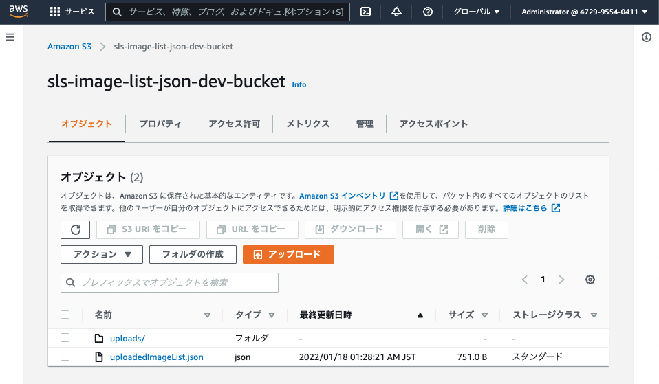

# 04.
## 課題内容
[ここ](../README.md#04.)

## 手順
[成果物はここ](./sls-image-list-json)

1. Create Project
    ```bash
    $ serverless create --template aws-nodejs --name sls-lambda-thumbnail --path sls-lambda-thumbnail

    $ yarn init
    $ yarn add --dev serverless-prune-plugin
    ```
2. `serverless.yml` の修正

    Lambda が S3 を操作するための IAM ロールを設定した
    ```yml
    provider:
      iam:
        role:
          statements:
            - Effect: Allow
              Action:
                - s3:ListBucket
                - s3:PutObject
              Resource: arn:aws:s3:::${self:service}-${self:provider.stage}-*
    ```
3. `handler.js` の作成
    - [S3 | AWS SDK for JavaScript](https://docs.aws.amazon.com/AWSJavaScriptSDK/latest/AWS/S3.html)
    - [put-object](https://awscli.amazonaws.com/v2/documentation/api/latest/reference/s3api/put-object.html?highlight=putobject)
    - [list-objects-v2](https://awscli.amazonaws.com/v2/documentation/api/latest/reference/s3api/list-objects-v2.html)
4. deploy
    ```sh
    $ sls deploy --verbose
    ```
5. 動作確認
    
    json が出力されてた
    
    
    出力ファイル
    ```json
    {
      "IsTruncated": false,
      "Contents": [
        {
          "Key": "uploads/",
          "LastModified": "2022-01-17T16:05:10.000Z",
          "ETag": "\"d41d8cd98f00b204e9800998ecf8427e\"",
          "Size": 0,
          "StorageClass": "STANDARD"
        },
        {
          "Key": "uploads/asset1.jpg",
          "LastModified": "2022-01-17T16:13:27.000Z",
          "ETag": "\"f7a358a47eb00d94da1014a5b99ffba6\"",
          "Size": 395596,
          "StorageClass": "STANDARD"
        },
        {
          "Key": "uploads/dog.jpg",
          "LastModified": "2022-01-17T16:05:18.000Z",
          "ETag": "\"cc59d45e24b018bac1f8aa1946f08d2e\"",
          "Size": 576464,
          "StorageClass": "STANDARD"
        }
      ],
      "Name": "sls-image-list-json-dev-bucket",
      "Prefix": "uploads",
      "MaxKeys": 1000,
      "CommonPrefixes": [],
      "KeyCount": 3
    }
    ```
## 疑問点
### 1. 
- Q: AWS リソースで ServerlessFramework で構築するものと、しないものの判断基準は？
- A: TODO: 調査中
  - sls で構築しているもの
    - DynamoDB
    - API Gateway
    - SQS
  - sls で構築しない方が良いもの
    - CICD関連
    - Network関連

## 参考記事
- なし