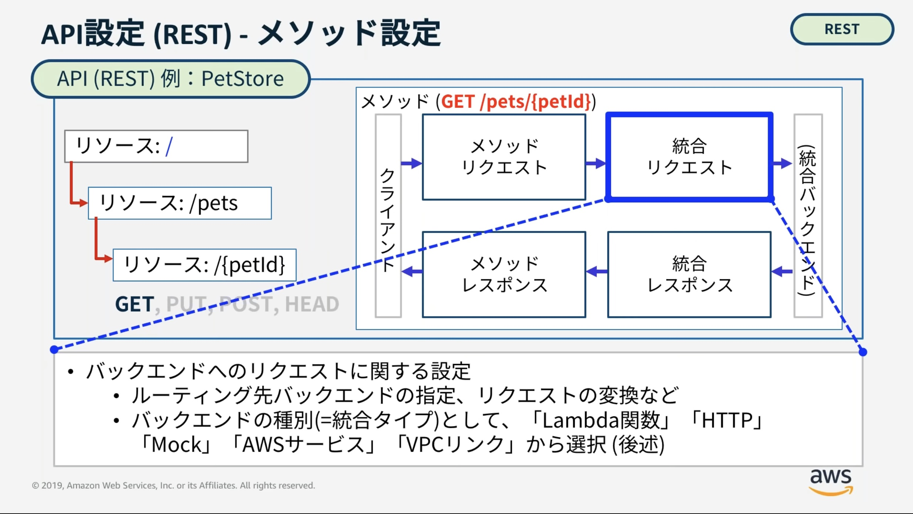

# 07.
## 課題内容
[ここ](../README.md#07.)

## 回答
### 1. メソッドリクエスト・統合リクエスト・統合レスポンス・メソッドレスポンス を説明してください
- メソッド設定
  - リソースとメソッドの組み合わせごとに設定できるAPI Gateway のフロー処理のこと
  - 4つのフローに分割される
    - メソッドリクエスト
    - 統合リクエスト
    - 統合レスポンス
    - メソッドレスポンス
- メソッドリクエスト
  - 「認証」や「リクエスト形式」を設定できる
    
    
  - 認証編
    - API Key が設定されているリクエストのみ、許可する
      - [Amazon API GatewayでAPIキー認証を設定する](https://dev.classmethod.jp/articles/apigateway-apikey-auth/)
    - IAM ロールが設定されているユーザのみ、リクエストを許可する
      - [API Gateway REST API の IAM 認証を有効にするにはどうすればよいですか?](https://aws.amazon.com/jp/premiumsupport/knowledge-center/iam-authentication-api-gateway/)
      - [API GatewayでIAM認証してみた](https://qiita.com/Kouichi_Itagaki/items/5d6e8ceaf3f0a970b594)
        - IAM ポリシー作成 -> IAM ユーザにアタッチ -> IAM ユーザの `Access key ID`と`Secret access key` をヘッダーにセット -> リクエスト成功
      - [API GatewayでAPIにIAM認証をかけて、Node.jsでSigV4署名ヘッダを作成してリクエストしてみる](https://dev.classmethod.jp/articles/api-gateway-iam-authentication-sigv4/)
  - リクエスト形式編
    - クエリパラメータやヘッダーのホワイトリストを設定できる
- 統合リクエスト
  - API Gateway がルーティングする向き先（バックエンド）の種類を設定できる
  - また、向き先への変換ルールなども指定できる
    
    
  - 向き先の種類のことを統合タイプ（Integration Type）と呼ぶ。統合タイプは5つある
    - Lambda
    - HTTP
    - Mock
    - AWS サービス
    - VPC
- 統合レスポンス
  - バックエンドからのレスポンスを、変換(マッピング)する設定ができる
    
    
- メソッドレスポンス
  - バックエンドからのレスポンスのステータスコードごとに、ヘッダーやカスタムデータを返すような設定ができる
    
    


#### 参考記事
- [AWS Black Belt Tech シリーズ 2015 - Amazon API Gateway](https://www.slideshare.net/AmazonWebServicesJapan/aws-black-belt-tech-2015-amazon-api-gateway?qid=dc240e40-effb-41eb-a0e7-038651c436c8&v=&b=&from_search=1)
- [【AWS Black Belt Online Seminar】Amazon API Gateway](https://youtu.be/EpEETIox03s)
- [API Gateway REST API](https://www.serverless.com/framework/docs/providers/aws/events/apigateway)
- [REST API の操作](https://docs.aws.amazon.com/ja_jp/apigateway/latest/developerguide/apigateway-rest-api.html)
### 2. 統合タイプを説明してください
- API Gateway がルーティングする向き先（バックエンド）のことを「**統合タイプ**」と呼ぶ
- 統合タイプは5つの種類がある
  - Lambda
  - HTTP
  - Mock
  - AWS サービス
  - VPC

### 3. Lambda プロキシ統合・Lambda 非プロキシ統合を説明してください

Lambdaプロキシ統合は、API Gateway から Lambda へのリクエストを自動でマッピングしてくれたり、Lambda から API Gateway へのレスポンスを自動でマッピングしてくれる優れもの！

#### 1. request編
**要約**
| | プロキシ統合 | 非プロキシ統合 |
| - | - | - |
| クエリパラメータ | 自動マッピング | マッピングの必要あり |

**Lambdaの実装**
```js
exports.handler = async (event) => {
  console.log("LAMBDA_EVENT", event);
  
  const response = {
      statusCode: 200,
      body: JSON.stringify('Hello from Lambda!'),
  };
  return response;
};
```

**proxy-integration event**

クエリパラメータがマッピングされる
```sh
2022-02-14T15:56:24.444Z	77200136-37ee-459c-8eb5-71e632d4ebb3	INFO	LAMBDA_EVENT {
  resource: '/',
  path: '/',
  httpMethod: 'GET',
  headers: {
    accept: 'text/html,application/xhtml+xml,application/xml;q=0.9,image/avif,image/webp,image/apng,*/*;q=0.8,application/signed-exchange;v=b3;q=0.9',
    'accept-encoding': 'gzip, deflate, br',
    'accept-language': 'ja-JP,ja;q=0.9,en-US;q=0.8,en;q=0.7',
    'cache-control': 'no-cache',
    Host: 'yh4s1cacl5.execute-api.ap-northeast-1.amazonaws.com',
    pragma: 'no-cache',
    'sec-ch-ua': '" Not;A Brand";v="99", "Google Chrome";v="97", "Chromium";v="97"',
    'sec-ch-ua-mobile': '?0',
    'sec-ch-ua-platform': '"macOS"',
    'sec-fetch-dest': 'document',
    'sec-fetch-mode': 'navigate',
    'sec-fetch-site': 'none',
    'sec-fetch-user': '?1',
    'upgrade-insecure-requests': '1',
    'User-Agent': 'Mozilla/5.0 (Macintosh; Intel Mac OS X 10_15_7) AppleWebKit/537.36 (KHTML, like Gecko) Chrome/97.0.4692.71 Safari/537.36',
    'X-Amzn-Trace-Id': 'Root=1-620a7ba8-437692bb58bd58b939f0b12e',
    'X-Forwarded-For': '60.114.99.112',
    'X-Forwarded-Port': '443',
    'X-Forwarded-Proto': 'https'
  },
  multiValueHeaders: {
    accept: [
      'text/html,application/xhtml+xml,application/xml;q=0.9,image/avif,image/webp,image/apng,*/*;q=0.8,application/signed-exchange;v=b3;q=0.9'
    ],
    'accept-encoding': [ 'gzip, deflate, br' ],
    'accept-language': [ 'ja-JP,ja;q=0.9,en-US;q=0.8,en;q=0.7' ],
    'cache-control': [ 'no-cache' ],
    Host: [ 'yh4s1cacl5.execute-api.ap-northeast-1.amazonaws.com' ],
    pragma: [ 'no-cache' ],
    'sec-ch-ua': [
      '" Not;A Brand";v="99", "Google Chrome";v="97", "Chromium";v="97"'
    ],
    'sec-ch-ua-mobile': [ '?0' ],
    'sec-ch-ua-platform': [ '"macOS"' ],
    'sec-fetch-dest': [ 'document' ],
    'sec-fetch-mode': [ 'navigate' ],
    'sec-fetch-site': [ 'none' ],
    'sec-fetch-user': [ '?1' ],
    'upgrade-insecure-requests': [ '1' ],
    'User-Agent': [
      'Mozilla/5.0 (Macintosh; Intel Mac OS X 10_15_7) AppleWebKit/537.36 (KHTML, like Gecko) Chrome/97.0.4692.71 Safari/537.36'
    ],
    'X-Amzn-Trace-Id': [ 'Root=1-620a7ba8-437692bb58bd58b939f0b12e' ],
    'X-Forwarded-For': [ '60.114.99.112' ],
    'X-Forwarded-Port': [ '443' ],
    'X-Forwarded-Proto': [ 'https' ]
  },
  queryStringParameters: { integration: 'proxy' },
  multiValueQueryStringParameters: { integration: [ 'proxy' ] },
  pathParameters: null,
  stageVariables: null,
  requestContext: {
    resourceId: 'lu6ujep089',
    resourcePath: '/',
    httpMethod: 'GET',
    extendedRequestId: 'NihCVHf_tjMFWbA=',
    requestTime: '14/Feb/2022:15:56:24 +0000',
    path: '/dev',
    accountId: '472995540411',
    protocol: 'HTTP/1.1',
    stage: 'dev',
    domainPrefix: 'yh4s1cacl5',
    requestTimeEpoch: 1644854184370,
    requestId: '2e761a1d-4466-46ff-81ed-b86738e815c7',
    identity: {
      cognitoIdentityPoolId: null,
      accountId: null,
      cognitoIdentityId: null,
      caller: null,
      sourceIp: '60.114.99.112',
      principalOrgId: null,
      accessKey: null,
      cognitoAuthenticationType: null,
      cognitoAuthenticationProvider: null,
      userArn: null,
      userAgent: 'Mozilla/5.0 (Macintosh; Intel Mac OS X 10_15_7) AppleWebKit/537.36 (KHTML, like Gecko) Chrome/97.0.4692.71 Safari/537.36',
      user: null
    },
    domainName: 'yh4s1cacl5.execute-api.ap-northeast-1.amazonaws.com',
    apiId: 'yh4s1cacl5'
  },
  body: null,
  isBase64Encoded: false
}
```

**custom-integration event**

クエリパラメータがマッピングされない
```sh
2022-02-14T15:56:09.883Z	0a40a589-a947-4253-84e5-e41872a66b6a	INFO	LAMBDA_EVENT 
{}
```

**custom-integratin + 統合リクエスト　マッピングテンプレート**

マッピングテンプレート（デフォルト）
```sh
##  See http://docs.aws.amazon.com/apigateway/latest/developerguide/api-gateway-mapping-template-reference.html
##  This template will pass through all parameters including path, querystring, header, stage variables, and context through to the integration endpoint via the body/payload
#set($allParams = $input.params())
{
  "body-json" : $input.json('$'),
  "params" : {
  #foreach($type in $allParams.keySet())
    #set($params = $allParams.get($type))
  "$type" : {
    #foreach($paramName in $params.keySet())
    "$paramName" : "$util.escapeJavaScript($params.get($paramName))"
      #if($foreach.hasNext),#end
    #end
  }
    #if($foreach.hasNext),#end
  #end
  },
  "stage-variables" : {
  #foreach($key in $stageVariables.keySet())
  "$key" : "$util.escapeJavaScript($stageVariables.get($key))"
    #if($foreach.hasNext),#end
  #end
  },
  "context" : {
    "account-id" : "$context.identity.accountId",
    "api-id" : "$context.apiId",
    "api-key" : "$context.identity.apiKey",
    "authorizer-principal-id" : "$context.authorizer.principalId",
    "caller" : "$context.identity.caller",
    "cognito-authentication-provider" : "$context.identity.cognitoAuthenticationProvider",
    "cognito-authentication-type" : "$context.identity.cognitoAuthenticationType",
    "cognito-identity-id" : "$context.identity.cognitoIdentityId",
    "cognito-identity-pool-id" : "$context.identity.cognitoIdentityPoolId",
    "http-method" : "$context.httpMethod",
    "stage" : "$context.stage",
    "source-ip" : "$context.identity.sourceIp",
    "user" : "$context.identity.user",
    "user-agent" : "$context.identity.userAgent",
    "user-arn" : "$context.identity.userArn",
    "request-id" : "$context.requestId",
    "resource-id" : "$context.resourceId",
    "resource-path" : "$context.resourcePath"
  }
}
```

統合リクエストでマッピングすれば、LambdaのEventで受け取れる
```sh
2022-02-14T16:40:39.077Z	010334f5-8215-498a-8c78-5d82fcac12cb	INFO	LAMBDA_EVENT {
  'body-json': {},
  params: {
    path: {},
    querystring: { integration: 'custom' },
    header: {
      accept: 'text/html,application/xhtml+xml,application/xml;q=0.9,image/avif,image/webp,image/apng,*/*;q=0.8,application/signed-exchange;v=b3;q=0.9',
      'accept-encoding': 'gzip, deflate, br',
      'accept-language': 'ja-JP,ja;q=0.9,en-US;q=0.8,en;q=0.7',
      'cache-control': 'max-age=0',
      Host: 'svprpyyxok.execute-api.ap-northeast-1.amazonaws.com',
      'sec-ch-ua': '" Not;A Brand";v="99", "Google Chrome";v="97", "Chromium";v="97"',
      'sec-ch-ua-mobile': '?0',
      'sec-ch-ua-platform': '"macOS"',
      'sec-fetch-dest': 'document',
      'sec-fetch-mode': 'navigate',
      'sec-fetch-site': 'none',
      'sec-fetch-user': '?1',
      'upgrade-insecure-requests': '1',
      'User-Agent': 'Mozilla/5.0 (Macintosh; Intel Mac OS X 10_15_7) AppleWebKit/537.36 (KHTML, like Gecko) Chrome/97.0.4692.71 Safari/537.36',
      'X-Amzn-Trace-Id': 'Root=1-620a8607-154e14fb7a942ba76cadcad5',
      'X-Forwarded-For': '60.114.99.112',
      'X-Forwarded-Port': '443',
      'X-Forwarded-Proto': 'https'
    }
  },
  'stage-variables': {},
  context: {
    'account-id': '',
    'api-id': 'svprpyyxok',
    'api-key': '',
    'authorizer-principal-id': '',
    caller: '',
    'cognito-authentication-provider': '',
    'cognito-authentication-type': '',
    'cognito-identity-id': '',
    'cognito-identity-pool-id': '',
    'http-method': 'GET',
    stage: 'dev',
    'source-ip': '60.114.99.112',
    user: '',
    'user-agent': 'Mozilla/5.0 (Macintosh; Intel Mac OS X 10_15_7) AppleWebKit/537.36 (KHTML, like Gecko) Chrome/97.0.4692.71 Safari/537.36',
    'user-arn': '',
    'request-id': '2ffad81b-f8b7-4eca-b9bc-f4d371200701',
    'resource-id': 'zhv71u72fd',
    'resource-path': '/'
  }
}
```

#### 2. response編
**要約**
| | プロキシ統合 | 非プロキシ統合 |
| - | - | - |
| ステータスコード | 自動マッピング | マッピングの必要あり |

**Lambda の実装**
```js
exports.handler = async (event) => {
  const response = {
    statusCode: 400,
    body: JSON.stringify('Hello from Lambda!'),
  };
  return response;
};
```

**proxy-integration**

想定通り、ステータスコードは400
```sh
$ curl -X GET -i https://yh4s1cacl5.execute-api.ap-northeast-1.amazonaws.com/dev/error
HTTP/2 400 
date: Tue, 15 Feb 2022 13:36:24 GMT
content-type: application/json
content-length: 20
x-amzn-requestid: a983eb0d-d18d-451c-8e53-4d25b18e4694
x-amz-apigw-id: Nlfd1FlStjMFS3Q=
x-amzn-trace-id: Root=1-620bac58-3747a8e0200a6a545b74c3ae;Sampled=0

"Hello from Lambda!"%
```

**custom-integration**

ステータスコード 200 !?!?
```sh
$ curl -X GET -i https://svprpyyxok.execute-api.ap-northeast-1.amazonaws.com/dev/error     
HTTP/2 200 
date: Tue, 15 Feb 2022 13:37:21 GMT
content-type: application/json
content-length: 50
x-amzn-requestid: 5dde5220-38e9-46e3-80e3-915cff42ac73
x-amz-apigw-id: NlfmyG4TtjMFg7w=
x-amzn-trace-id: Root=1-620bac91-1e05a12e0d68e76e2f131769;Sampled=0

{"statusCode":400,"body":"\"Hello from Lambda!\""}%
```

例外処理用にコードを修正
```js
exports.handler = async (event) => {
  const response = {
      statusCode: 400,
      body: JSON.stringify('Hello from Lambda!'),
  };
  throw Error(JSON.stringify(response))
};
```

API Gateway 統合レスポンスを修正

| Lambda エラーの正規表現 | メソッドレスポンスのステータス | 出力モデル | デフォルトのマッピング |
|-|-|-|-|
|	-	| 200	|	| はい |
| .*"statusCode":400.* | 400 | | いいえ |

今度は、ステータスコード 400
```sh
$ curl -X GET -i https://svprpyyxok.execute-api.ap-northeast-1.amazonaws.com/dev/error
HTTP/2 400 
date: Tue, 15 Feb 2022 15:44:42 GMT
content-type: application/json
content-length: 298
x-amzn-requestid: 4da27b56-2f30-4bc2-807c-b24f1e378d8b
x-amz-apigw-id: NlyQpFoFNjMFsmg=
x-amzn-trace-id: Root=1-620bca6a-00ba736c12fba15d2210aa71;Sampled=0

{"errorType":"Error","errorMessage":"{\"statusCode\":400,\"body\":\"\\\"Hello from Lambda!\\\"\"}","trace":["Error: {\"statusCode\":400,\"body\":\"\\\"Hello from Lambda!\\\"\"}","    at Runtime.exports.handler (/var/task/index.js:9:11)","    at Runtime.handleOnce (/var/runtime/Runtime.js:66:25)"]}%
```

マッピングの別の方法を試すために、実装修正
```js
exports.handler = async (event) => {
  throw new Error('Internal Error - Intentionally throw this error');
};
```

API Gateway 統合レスポンス（修正前）
| Lambda エラーの正規表現 | メソッドレスポンスのステータス | 出力モデル | デフォルトのマッピング |
|-|-|-|-|
|	-	| 200	|	| はい |
| .*"statusCode":400.* | 400 | | いいえ |

ステータスコード 200 だ、、、、
```sh
$ curl -X GET -i https://svprpyyxok.execute-api.ap-northeast-1.amazonaws.com/dev/error
HTTP/2 200 
date: Tue, 15 Feb 2022 15:47:40 GMT
content-type: application/json
content-length: 272
x-amzn-requestid: defa29f1-f8ae-4c26-a3c0-a18256cdec6d
x-amz-apigw-id: NlyseHRBtjMFo8g=
x-amzn-trace-id: Root=1-620bcb1c-547c00c10b2231f6251d1302;Sampled=0

{"errorType":"Error","errorMessage":"Internal Error - Intentionally throw this error","trace":["Error: Internal Error - Intentionally throw this error","    at Runtime.exports.handler (/var/task/index.js:2:11)","    at Runtime.handleOnce (/var/runtime/Runtime.js:66:25)"]}%
```

API Gateway 統合レスポンス（修正後）
| Lambda エラーの正規表現 | メソッドレスポンスのステータス | 出力モデル | デフォルトのマッピング |
|-|-|-|-|
|	-	| 200	|	| はい |
| .*"statusCode":400.* | 400 | | いいえ |
| ^Internal Error.* | 500 | | いいえ |


ステータスコード 500 で期待通り
```sh
$ curl -X GET -i https://svprpyyxok.execute-api.ap-northeast-1.amazonaws.com/dev/error
HTTP/2 500 
date: Tue, 15 Feb 2022 15:49:59 GMT
content-type: application/json
content-length: 272
x-amzn-requestid: 467dbdfe-77e8-466e-9c5a-826016a8cb3f
x-amz-apigw-id: NlzCRG-FNjMFe4g=
x-amzn-trace-id: Root=1-620bcba7-38d3b91e626814580e449e85;Sampled=0

{"errorType":"Error","errorMessage":"Internal Error - Intentionally throw this error","trace":["Error: Internal Error - Intentionally throw this error","    at Runtime.exports.handler (/var/task/index.js:2:11)","    at Runtime.handleOnce (/var/runtime/Runtime.js:66:25)"]}%
```


#### 参考記事
- [API Gateway integration response setup for AWS Lambda](https://dev.to/awscommunity-asean/api-gateway-integration-response-setup-for-aws-lambda-25km)
- [API Gateway が「Lambda プロキシ統合」でさらに使いやすくなっててびっくりした話](https://dev.classmethod.jp/articles/api-gateway-lambda-integration-fabu/)
- [[初心者向け] Lambda 非プロキシ統合で API Gateway API をビルドする をプロキシ統合にして比較してみる](https://dev.classmethod.jp/articles/for-beginner-build-apigateway-with-noproxy-and-proxy-lambda/)
- [API Gateway で Lambda エラーを処理する](https://docs.aws.amazon.com/ja_jp/apigateway/latest/developerguide/handle-errors-in-lambda-integration.html#handle-standard-errors-in-lambda-integration)
  > Lambda カスタム統合の場合、統合レスポンスで Lambda によって返されたエラーを、クライアントの標準 HTTP エラーレスポンスにマップする必要があります。そうしないと、Lambda のエラーはデフォルトで 200 OK レスポンスとして返されるため、API ユーザーは直感的に理解できません。

## 疑問点
### 1. 統合レスポンスとメソッドレスポンス
- Q: 統合レスポンスとメソッドレスポンスの違いは？
- A: 違いある
  - わからなかった原因
    - Lambda非プロキシ統合でLambdaがエラーを返す場合に、マッピングしないと200 OK になる現象を理解していなかった。
  - 違い
    - 統合レスポンスは変換する、メソッドレスポンスは付与する

### 2. Lambda プロキシ統合 or Lambda 非プロキシ統合 
- Q: Lambda プロキシ統合 と Lambda 非プロキシ統合 どっち採用する？
- A: Lambda プロキシ統合
  - [Serverless Framework](https://www.serverless.com//framework/docs-providers-aws-events-apigateway#:~:text=http-proxy%20%2F%20http_proxy-,mock,-The%20Framework%20uses) のドキュメントにLambda プロキシ統合がデフォルトって書いてあった
    > The Framework uses the lambda-proxy method (i.e., everything is passed into your Lambda) by default unless another method is supplied by the user
  - Lambda 非プロキシ統合 の場合、マッピング作業がめんどくさい
  - Lambda プロキシ統合なら、ロジックをバックエンドに集約できる
    - [API Gateway + Lambda プロキシ結合の使用有無による違い](https://qiita.com/yuuwatanabe/items/a3bd65e709f20574b6db)
      > 2つのやり方の違いは結局はAPI Gateway側に仕事を担当させるのか、Lambda側に処理を寄せるのかなので、ケースバイケースなのかなと思っています。バックエンド側の知識の方が豊富ならプロキシ統合を使ってLambda側に処理を寄せてしまうという考え方もアリなのかなと思いました。
    
