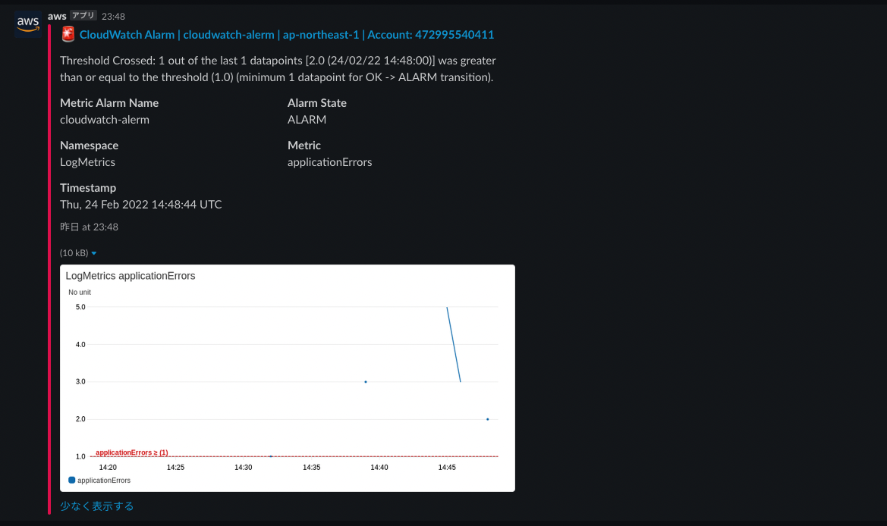

# 09.
## 課題内容
[ここ](../README.md#09.)

## 回答
### 1. 業務エラーとシステムエラーを説明してください
- 前提
  - 例外とエラーに差をつけずにどちらも例外とする
- 例外とは
  - 何かしらの「リカバリー」が必要な状態
  - 例
    - 「同じIDを持つユーザを新規登録することはできない」などのビジネス要件を満たしていない場合、クライアント側で「エラーメッセージを表示する」リカバリーが必要
    - 「クライアントのリクエスト形式が不正」の場合は、クライアント側に「開発者に連絡してくれ、というメッセージを表示する」リカバリーが必要
    - 「ネットワークエラー」の場合、システム側で「リトライ処理」のリカバリーが必要
- 業務エラーとシステムエラー
  - 業務エラーは「クライアント」側でリカバリーする必要があるもの
  - システムエラーは「システム」側でリカバリーする必要があるもの

#### 参考記事
- [例外処理の設計のやり方](https://qiita.com/tomokiyao/items/3860c8e3cd3f21126b21)
- [JavaScript/TypeScriptの例外ハンドリング戦略を考える](https://qiita.com/shibukawa/items/ffe7264ecff78f55b296)
- [例外処理 | 仕事ですぐに使えるTypeScript](https://future-architect.github.io/typescript-guide/exception.html#)
- [エラー処理をパターンにはめよう](https://codezine.jp/article/detail/6553)
- [例外設計における大罪](https://www.slideshare.net/t_wada/exception-design-by-contract)
- [技術的例外とビジネス例外を明確に区別する](https://プログラマが知るべき97のこと.com/エッセイ/技術的例外とビジネス例外を明確に区別する/)
- [死ぬはずのプログラムを無理に生かしておいてはいけない](https://プログラマが知るべき97のこと.com/エッセイ/死ぬはずのプログラムを無理に生かしておいてはいけない/)
- [エラーを無視するな](https://プログラマが知るべき97のこと.com/エッセイ/エラーを無視するな/)
- [アプリケーションと三種の異常](https://dev.classmethod.jp/articles/application-and-3-kinda-errors/)

### 2. ログレベルを説明してください
#### ログ
- なぜログを収集するのか
  - 問題が発生したときに調査するため
  - 問題の発生を防ぐため
  - 監査
  - 行動ログを収集するため
- 何のログを収集すべきか
  - 4W1H に従うのが良い(WHYは不要)
    - 処理時間（いつ）
    - アクセス元（誰が）
    - アクセス対象（誰に）
    - 処理内容（どんなリクエストをしたか）
    - 処理対象（何を処理したか）
    - 処理結果（どうなったか）
    - イベントID（一連のイベントのID）
    - ログレベル（ログのレベル）
  - 収集してはいけないもの（もしくは、マスキングする必要あり） 
    - 個人情報
    - パスワード
    - etc
- いつどこでログを収集すべきか（Clean Architecture編）
  - HTTP Request/Response や DB との接続などの外部とのやりとりに関するログは、インフラ層
    - [Clean architecture logging](https://stackoverflow.com/questions/60808994/clean-architecture-logging)
    - [Logger in Clean Architecture](https://stackoverflow.com/questions/53419938/logger-in-clean-architecture)
    - [Clean Architecture History/Activity Logging](https://stackoverflow.com/questions/55631310/clean-architecture-history-activity-logging)
    - [Logging interface in domain layer](https://stackoverflow.com/questions/24360011/logging-interface-in-domain-layer)
- どうやってログを収集すべきか
  - ライブラリを使おう
    > 1. Don’t Write Logs by Yourself (AKA Don’t Reinvent the Wheel)

    [Logging Best Practices: The 13 You Should Know](https://www.dataset.com/blog/the-10-commandments-of-logging/#:~:text=1.%20don%E2%80%99t%20write%20logs%20by%20yourself%20(aka%20don%E2%80%99t%20reinvent%20the%20wheel))
  - JavaScript なら [log4js-node](https://www.npmjs.com/package/log4js)
#### ログレベル
- ログレベルとは
  - ログの用途によって、分類したもの
  - 開発環境でXXXのログは見たいけど、商用環境でXXXのログは見ない、場合などに便利
- 表
  |レベル|概要|説明|いつ使うか|
  |-|-|-|-|
  |fatal|致命的なエラー|プログラムの異常終了を伴うようなもの|障害時|
  |error|エラー|予期しないその他の実行時エラー|例外発生時|
  |warn|警告|アプリケーションは提供できるが対応が望まれる|ネットワークエラーなどの一時的な環境条件のとき|
  |info|情報|実行時の何らかの注目すべき事象（開始や終了など）|記録しておくべき情報を実行するとき|
  |debag|デバッグ情報|システムの動作状況に関する詳細な情報|開発時|
  |trace|トレース情報|デバッグ情報よりも、更に詳細な情報|開発時|
- どこまでログレベルを細かく利用する？
  - error, info, debug くらいで良いかな？
  - info がないのは辛そう
- Tips
  - [INFOレベル以上の情報のみでそのリクエストによって何の処理が行われたかがトレースできるか](https://dev.classmethod.jp/articles/recommend-operation-for-bigoted-developers/#:~:text=%E3%81%8D%E3%81%A7%E3%81%97%E3%82%87%E3%81%86%E3%80%82-,info%E3%83%AC%E3%83%98%E3%82%99%E3%83%AB%E4%BB%A5%E4%B8%8A%E3%81%AE%E6%83%85%E5%A0%B1%E3%81%AE%E3%81%BF%E3%81%A6%E3%82%99%E3%81%9D%E3%81%AE%E3%83%AA%E3%82%AF%E3%82%A8%E3%82%B9%E3%83%88%E3%81%AB%E3%82%88%E3%81%A3%E3%81%A6%E4%BD%95%E3%81%AE%E5%87%A6%E7%90%86%E3%81%8B%E3%82%99%E8%A1%8C%E3%82%8F%E3%82%8C%E3%81%9F%E3%81%8B%E3%81%8B%E3%82%99%E3%83%88%E3%83%AC%E3%83%BC%E3%82%B9%E3%81%A6%E3%82%99%E3%81%8D%E3%82%8B%E3%81%8B,-%E3%83%AD%E3%82%B0%E3%83%AC%E3%83%99%E3%83%AB%E3%81%AF)

#### 参考記事
- [ログ設計指針](https://qiita.com/nanasess/items/350e59b29cceb2f122b3)
- [開発者が運用を経験すべき一つの理由](https://dev.classmethod.jp/articles/recommend-operation-for-bigoted-developers/)
- [ロギング設計大全](https://scrapbox.io/kawasima/%E3%83%AD%E3%82%AE%E3%83%B3%E3%82%B0%E8%A8%AD%E8%A8%88%E5%A4%A7%E5%85%A8)
- [ロギングベストプラクティス](https://scrapbox.io/kawasima/%E3%83%AD%E3%82%AE%E3%83%B3%E3%82%B0%E3%83%99%E3%82%B9%E3%83%88%E3%83%97%E3%83%A9%E3%82%AF%E3%83%86%E3%82%A3%E3%82%B9)
- [ログ出力指針の書き方](https://seri.hatenablog.com/entry/2018/10/20/172656)
- [ログ出力の設計指針。書き方、フォーマットの例](https://applis.io/posts/how-to-design-log-output)
- [【実録ドキュメント】そのログ本当に必要ですか？](https://atmarkit.itmedia.co.jp/ait/articles/0705/24/news133.html)
- [スタックトレース (stack trace)とは](https://wa3.i-3-i.info/word13281.html)

### 3. Lambdaでエラー発生時に、Slackに通知してください
#### 3.1 メトリクスフィルター vs サブスクリプションフィルター (GUI編)
ここら辺を読んだけど、違いがよくわからんので、作ってみることにした
- [CloudWatch Logsの特定文字を検知してログ内容を通知するLambda Function](https://dev.classmethod.jp/articles/cwl-lambda-sns-publish/)
- [CloudWatch LogsのLambdaによるログ監視](https://dev.classmethod.jp/articles/notify-error-cloudwatch-logs-with-lambda/)

##### メトリクスフィルター
業務で採用していたケース
- できていること
  - エラー内容がGoogle Chatに連携される
- 利用プラグイン
  - [Serverless AWS Alerts Plugin](https://www.serverless.com/plugins/serverless-plugin-aws-alerts) を利用
- 構成
  - CloudWatch Metrics Filter × CloudWatch Alerm × SNS × Lambda × GoogleChat

下記記事を参考に、作成
- [AWS Chatbotを使ってCloudWatch Logsのエラーログをslackに通知する](https://blog.chakimar.net/aws-chatbot-cloudwatch-logs/)

概要
- ロググループに、ERROR という文字に反応する、メトリクスフィルターを作成
- n秒おきにメトリクスを監視して、閾値以上の場合にアラームを発砲する

成果物
- こんな感じでSlackのチャンネルに連携される


思ったこと
- エラーが発生したことは通知されるけど、エラー内容が通知されないじゃん、、、
- 調べてみた
  > このとき「Lambda上でログの内容を取得したい」ということを追加で行う必要があることがわかりました。となると、Alarm経由では「特定のログが来たこと」は分かるのですが、「特定のログの内容」を知るためには、いい感じにさかのぼってあげる必要があるようでした。(こちらの記事を参考にしていました https://qiita.com/onooooo/items/f59c69e30dc5b477f9fd )
  
  [CloudWatch-LogsからリアルタイムにLambdaを呼ぶ](https://qiita.com/uetash/items/166e42b7842b48917451)
- 確かに、業務でも、Lambdaで頑張ってた、、、、
- serverless-plugin-aws-alerts は、EC2のCPU使用率やDynamoDBのスロットリング数などのAWSサービスの状態を監視できるし、Lambdaのエラー内容を通知できるから一石二鳥じゃんと思っていた。だけど、エラー内容を連携するには、工夫が必要そう。ただエラーを連携したいだけなのに、だいぶ手間がかかる印象
- だからサブスクリプションフィルターなのか、、、

##### サブスクリプションフィルター
下記記事を参考に、作成
- [CloudWatch-LogsからリアルタイムにLambdaを呼ぶ](https://qiita.com/uetash/items/166e42b7842b48917451)

思ったこと
- メトリックスは表示できないけど、エラーメッセージの取得は圧倒的に楽
- Slackに通知したい場合は、いろいろ手段がありそう
  - [AWSからSlackに通知する方法についてまとめた](https://dev.classmethod.jp/articles/how-to-send-message-by-aws/)

#### 3.2 サブスクリプションフィルター(Serverless Framework編)
[成果物はここ](./sls-rest-api-notify-error)
```sh
$ npm i -D serverless-plugin-log-subscription
```

- 問題点
  - サブスクリプションフィルターは1つしかフィルターできない。
  - そのため、ERRORとWARNを検知する方法はない。
  - しかも、LogSubscriptionのdestinationArnのLambdaは事前に作成しておく必要があるみたい、、
  - ちょっとめんどくさいかも、、、、
- 解決策
  - そんなことはなかった
  - 公式に方法が記載されていた
    > [Lambda function directly:](https://github.com/dougmoscrop/serverless-plugin-log-subscription#:~:text=lambda%20function%20directly%3A)

#### 結論
- メトリクス情報とサブスクリプションフィルターを両方利用。
- エラーの詳細内容はサブスクリプションフィルターでSlack連携
- メトリクスフィルターは、エラー内容を取得するための処理がめんどくさいため、サブスプリプションフィルターを採用

#### 参考記事
- [サーバー内のエラーログ出力時、CloudWatch Logsサブスクリプションフィルタを使用し、LambdaでSlackに通知](https://qiita.com/holdout0521/items/e566faa62b02226f6749)
- [Serverless時代のシステム監視、ノイズ通知だらけな日々を経験しての反省点](https://techblog.zozo.com/entry/serverless-monitoring-lambda)
- [Error | MDN Web Docs](https://developer.mozilla.org/ja/docs/Web/JavaScript/Reference/Global_Objects/Error)
- [JavaScript でカスタム例外をしっかり使う](https://qiita.com/necojackarc/items/c77cf3b5368b9d33601b)
- [カスタムエラー, Error の拡張](https://ja.javascript.info/custom-errors)
- [AWS Lambda error handling](https://pages.awscloud.com/rs/112-TZM-766/images/AWS-35_AWS_Summit_Online_2020_MAD01.pdf)
- [エラー制御の勘所とモニタリング](https://d1.awsstatic.com/serverless-jp/seminars/20210909_serverless_session2.pdf)

## 疑問点
### 1. CloudWatch
- Q: エラー検知する方法はいくつかある？メトリクスフィルターとかサブスクリプションフィルターの記事があって、違いが理解できていない
- A: A


